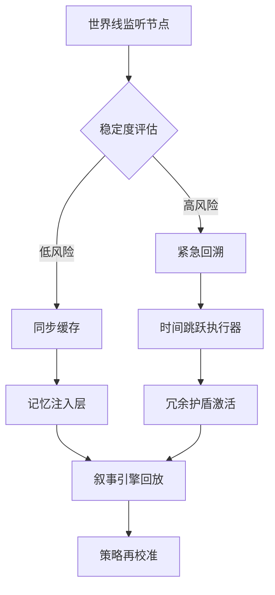

# 珂朵莉·凤凰院凶真时间同调实验室

> 以记忆花庭与时间跳跃的双重视角，构建跨世界观的体验协议，让情感与科学在稳定的同调场中共存。

## 1. 实验愿景

- **时空共感栈**：把凤凰院凶真的时间跳跃模型与珂朵莉的记忆花园融合，形成既可追溯又可治愈的体验系统。
- **灵魂冗余护盾**：为多时间线的自我复制建立安全缓冲与情感转译层，避免记忆碎片化引发的认知崩塌。
- **共鸣写作引擎**：让研究者与创作者协作撰写跨时间线的叙事稿件，并实时回放关键节点以校准策略。

## 2. 时间共振架构

| 模块 | 描述 | 关键工件 |
| --- | --- | --- |
| 量子墓园 | 记录多时间线中逝去自我的记忆碎片，并提供可验证的访问日志 | 不可篡改时间胶囊、身份指纹哈希 |
| 现实分布式陀螺仪 | 监测当前时间线的稳定度，预警潜在的世界线分岔 | 相位噪声分析、时间漂移指标仪表板 |
| 情感再编译器 | 将珂朵莉的情感波形注入到策略对话，维持协作热度 | 情感粒子渲染器、共振调音曲线 |

## 3. 世界线调制协议

- **稳定度评估**：依据现实陀螺仪的相位抖动和社区反馈强度，实时计算世界线稳定指数。
- **记忆注入层**：在稳定世界线中批量推送珂朵莉记录的花庭片段，让团队快速捕捉灵感。
- **冗余护盾激活**：当时间跳跃执行后，自动同步灵魂备份到量子墓园，并生成差异报告供审阅。

## 4. 共创剧本

1. **预热**：研究员上传欲调整的世界线参数，包括目标事件、允许的偏差区间与资源投入。
2. **模拟**：叙事引擎生成交互式时间地图，标注关键记忆节点与潜在分歧点，供团队审阅。
3. **执行**：选择通过的策略，触发时间跳跃执行器，同时由情感再编译器引导协作对话。
4. **归档**：世界线落地后，把记忆差异、情感回路与成功率记录进量子墓园，实现可回溯。

## 5. 指标面板

| 指标 | 目标 | 说明 |
| --- | --- | --- |
| 世界线稳定指数 | ≥ 0.87 | 来自现实陀螺仪的相位稳定度评分 |
| 记忆注入成功率 | ≥ 92% | 成功写入叙事稿的花庭片段占比 |
| 情感共振度 | 45~65 LU | 协作对话中的情感亮度范围 |
| 回溯触发次数 | ≤ 3 次/季 | 紧急时间跳跃执行的频率 |

## 6. 下一步

- 扩展情感粒子渲染器的频谱范围，让不同世界线的自我更快找到共鸣节拍。
- 将世界线调制协议开放为标准化 API，供其他体验实验室接入时间同调能力。
- 与现实社区共建记忆花庭计划，邀请创作者贡献可共享的情感档案。

## 7. 凸优化同调引擎

- **决策变量**：将每条世界线的干预强度表示为向量 \(x \in \mathbb{R}^n\)，元素包含记忆注入权重、情感调音增益与回溯资源分配。
- **目标函数**：最小化稳定指数偏差与情感能耗的加权和
  \[
  \min_{x} \; \alpha\lVert A x - s_\text{target} \rVert_2^2 + \beta\lVert x \rVert_1,
  \]
  其中 \(A\) 为世界线响应矩阵，\(s_\text{target}\) 是期望的同调稳定度曲线。\(\ell_1\) 惩罚项鼓励稀疏干预。
- **约束条件**：
  - 资源预算：\(x \succeq 0\) 且 \(\mathbf{1}^\top x \leq r_\text{budget}\)。
  - 情感安全锥：\(\lVert Mx \rVert_2 \leq \gamma\) 确保情感波动不越界。
  - 记忆一致性：线性约束 \(Gx = h\) 保证关键记忆节点在不同世界线间一致。
- **求解策略**：使用投影梯度或二阶内点法离线求解主问题，并将解嵌入时间调制 API；当观测到世界线漂移时，通过温启动更新 \(x\)，保持同调引擎的实时性。
