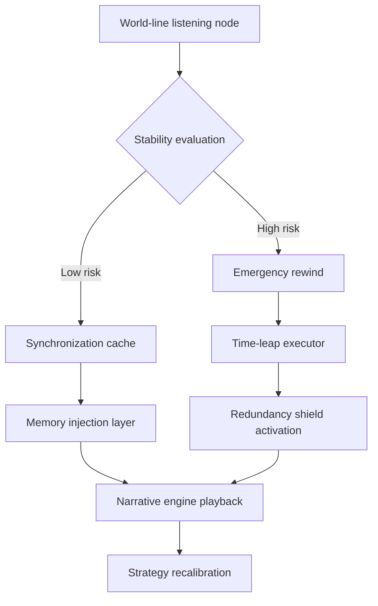

# Chtholly · Hououin Temporal Synchrony Lab

> Fuse the memory garden of Chtholly with Hououin Kyouma’s time-leap mechanics to craft a cross-world protocol where emotion and science can resonate inside a stable synchrony field.

## 1. Experiment Vision

- **Temporal empathy stack**: Merge Hououin’s time-jump model with Chtholly’s memory conservatory to build an experience system that is both traceable and restorative.
- **Soul redundancy shield**: Provide buffer zones and translation layers for copies of the self that exist across timelines so that fragmented memories do not trigger cognitive collapse.
- **Resonant writing engine**: Allow researchers and storytellers to co-author scripts that span multiple world lines while replaying pivotal moments in real time to recalibrate strategy.

## 2. Temporal Resonance Architecture

| Module | Description | Key Artifacts |
| --- | --- | --- |
| Quantum Necropolis | Stores memory shards of selves that perished in alternate timelines and keeps a verifiable access log | Immutable temporal capsules, identity fingerprint hashes |
| Distributed Reality Gyroscope | Monitors the stability of the active timeline and flags potential forks | Phase-noise analytics, timeline drift dashboard |
| Emotion Recompiler | Injects Chtholly’s emotional waveforms into strategic dialogues to sustain collaborative energy | Emotional particle renderer, resonance tuning curve |

## 3. World-Line Modulation Protocol

- **Stability evaluation**: Continuously compute the world-line stability index using phase jitter from the reality gyroscope and the intensity of community feedback.
- **Memory injection layer**: Broadcast batches of Chtholly’s garden fragments into stable world lines so teams can harvest inspiration quickly.
- **Redundancy shield activation**: Whenever a time leap completes, synchronize soul backups to the quantum necropolis and generate differential reports for review.

## 4. Co-Creation Script

1. **Warm-up**: Researchers upload the parameters of the world line they want to adjust, including target events, acceptable deviation windows, and resource budgets.
2. **Simulation**: The narrative engine produces an interactive temporal map annotated with key memories and possible divergence nodes for the team to inspect.
3. **Execution**: Approve a strategy, trigger the time-leap executor, and let the emotion recompiler facilitate collaborative dialogue.
4. **Archiving**: After the world line settles, record memory deltas, emotional circuits, and success rates into the quantum necropolis for full traceability.

## 5. Metric Dashboard

| Metric | Target | Notes |
| --- | --- | --- |
| World-line stability index | ≥ 0.87 | Phase-stability score from the reality gyroscope |
| Memory injection success rate | ≥ 92% | Fraction of garden fragments written into the script |
| Emotional resonance | 45–65 LU | Desired emotional luminance band during collaboration |
| Rewind triggers | ≤ 3 per quarter | Frequency of emergency time jumps |

## 6. Next Moves

- Expand the spectral range of the emotional particle renderer so that selves from different world lines can lock onto a shared beat faster.
- Expose the world-line modulation protocol as a standard API so other experience labs can adopt temporal synchrony capabilities.
- Launch a community memory-garden program that invites creators to contribute shareable emotional archives.

## 7. Convex Synchrony Engine

- **Decision variables**: Represent each world-line intervention as a vector \(x \in \mathbb{R}^n\) with elements for memory weights, emotional gain, and rewind resource allocation.
- **Objective**: Minimise the weighted sum of stability deviation and emotional energy,
  \[
  \min_{x} \; \alpha\lVert A x - s_{\text{target}} \rVert_2^2 + \beta\lVert x \rVert_1,
  \]
  where \(A\) is the world-line response matrix and \(s_{\text{target}}\) the desired synchrony curve. The \(\ell_1\) term encourages sparse interventions.
- **Constraints**:
  - Resource budget: \(x \succeq 0\) and \(\mathbf{1}^\top x \leq r_{\text{budget}}\).
  - Emotional safety cone: \(\lVert Mx \rVert_2 \leq \gamma\) keeps affective swings within bounds.
  - Memory consistency: Linear constraints \(Gx = h\) preserve key memory nodes across timelines.
- **Solution strategy**: Solve the master problem offline with projected gradients or second-order interior-point methods, embed the solution in the modulation API, and warm-start updates to \(x\) whenever drift is detected to keep the synchrony engine responsive.
