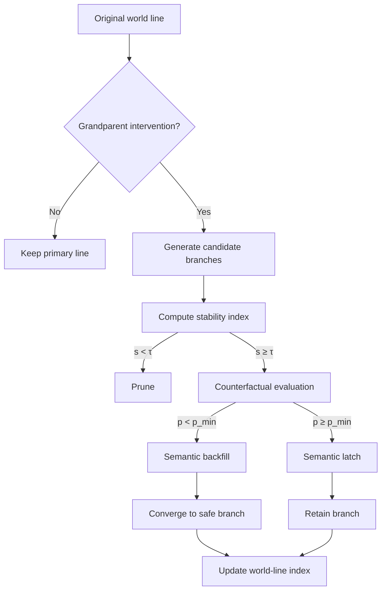

# Grandfather Paradox World-Line Pruning Strategies

> In narrative systems that permit time travel, the grandfather paradox exposes fragile causal chains. Effective pruning keeps the tree of world lines coherent and controllable.

## 1. Paradox Context

- **Definition**: A traveller goes back in time and prevents their grandparent from surviving, creating a self-negating loop in which the traveller’s own existence is impossible.
- **World-line perspective**: Model temporal history as a weighted directed graph \(G = (V, E)\) where nodes are events and edge weights express causal strength or probability.
- **Conflict source**: Intervening in the grandparent event creates contradictory cycles that break the partial order structure of \(G\).

## 2. Pruning Formulation

| Element | Description | Mathematical Form |
| --- | --- | --- |
| World-line tree \(T\) | All branches spawned from the original history | Depth-first expansion \(T = (N, A)\) |
| Pruning action | Remove inconsistent or overly costly branches | Choose \(S \subseteq A\) satisfying constraints |
| Feasibility constraint | Prevent causal cycles and keep the traveller alive | \(\forall n \in N,\; f(n) \ge 0\) |
| Cost function | Balance historical deviation and intervention effort | \(J = \alpha C_{\text{div}} + \beta C_{\text{energy}}\) |

- **Deviation cost \(C_{\text{div}}\)**: Measures divergence from the original history at key events; cosine similarity or KL divergence works well.
- **Energy cost \(C_{\text{energy}}\)**: Quantifies energy or ethical expenditure, typically proportional to the number and depth of pruned branches.

## 3. Pruning Strategy Stack

### 3.1 Stability Threshold Strategy

1. Compute a causal stability score \(s_i\) for each candidate branch.
2. Set a threshold \(\tau\); prune whenever \(s_i < \tau\).
3. Adapt \(\tau\) to control branch count and keep overall risk within budget.

> Use this for rapid response: once the grandparent event is threatened, unstable branches are cut immediately.

### 3.2 Counterfactual Backfill Strategy

- Build counterfactual simulations \(H_i\) to estimate the probability \(p_i\) that the traveller continues to exist after the grandparent event is blocked.
- If \(p_i < p_{\text{min}}\), overwrite that branch with a terminal state where the traveller loses the conditions required to intervene.
- Backfilling reduces the self-negation pressure and restores causal closure.

### 3.3 Semantic Latching Strategy

- Tag the grandparent event with semantic labels (kinship, identity, legal inheritance, etc.).
- Latch the semantics to higher nodes and forbid destructive operations on them.
- Allow low-risk micro-adjustments (e.g., changing meeting locations) to produce reversible fine-grained branches.

## 4. Algorithm Flow

- **Update world-line index**: Maintain a visual index or hash map detailing the status, cost, and grandparent relationships of retained branches for auditing.
- **Mainline playback**: Periodically replay surviving branches to ensure no hidden paradox emerges.

## 5. Metrics

| Metric | Description | Target |
| --- | --- | --- |
| World-line consistency score | Average partial-order consistency after pruning | ≥ 0.92 |
| Paradox residual index | Residual risk of self-referential contradictions | ≤ 0.05 |
| Intervention energy | Normalised cost of traveller interventions | 0.3–0.6 |
| Playback success rate | Probability that replay passes consistency checks | ≥ 95% |

## 6. Implementation Notes

- **Define minimal intervention units**: Use semantic layers to identify which operations are high-risk pruning targets.
- **Deploy multi-agent collaboration**: Let independent pruning agents evaluate stability on separate branches and reconcile decisions through consensus protocols.
- **Introduce ethical weights**: Add an ethical liability term \(C_{\text{ethics}}\) to the cost function so mathematical consistency does not override human values.
- **Record provenance**: Generate evidence for every pruning action, including traveller identity, intervention time, and model version.

## 7. Outlook

- Extend pruning strategies to multi-traveller games and analyse Nash equilibria when several travellers target the same grandparent event.
- Explore adaptive pruning via quantum decoherence, allowing decoherence to suppress impossible world lines naturally.
- Apply these techniques to real-world causal modelling, such as policy simulations that need high-robustness intervention planning.
