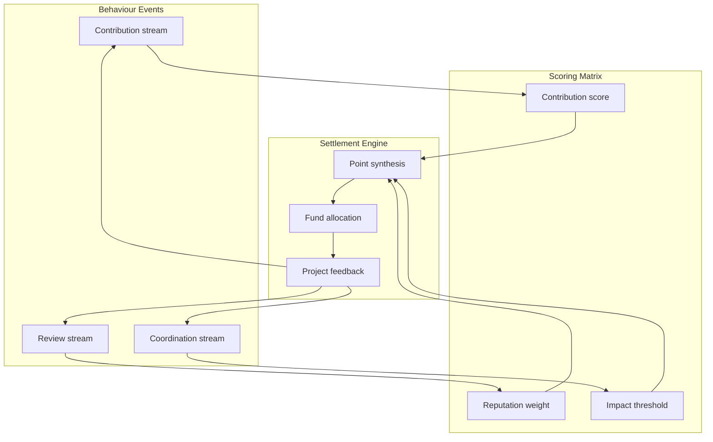

# Micro-Incentive Bridge Lab

> Build bridges across communities so micro-contributions, cash flows, and reputation networks flow through a unified settlement protocol. The result is precise steering and real-time adjustment for public projects.

## 1. Vision

- **Sustainable public goods**: Capture and amplify tiny contributions across platforms and communities so they accumulate into durable public assets.
- **Transparent incentives**: Publish all rules, weights, and settlement outcomes simultaneously on-chain and on dashboards so contributors understand where value comes from.
- **Adaptive governance**: Use feedback control and collaboration scripts to adjust incentive strength according to community conditions, avoiding oversubsidy or stale rewards.

## 2. Bridge Topology

| Component | Description | Key Elements |
| --- | --- | --- |
| Behaviour intake | Streams events from GitHub, Discord, Notion, and other collaboration tools | Webhook adaptors, event normalisation, anti-spam filters |
| Incentive pricing layer | Maps contributions to base points, then weights them by reputation and goal functions | Multi-objective optimisation, on-chain oracles, risk buffer pool |
| Settlement bridge | Automates payouts across multi-chain wallets, stablecoins, and fiat gateways | MPC signatures, payment routing, risk engine |
| Public-project pool | Governance contracts holding projects and KPIs | Whitelists, KPI subscriptions, dynamic escrow |

## 3. Incentive Protocol

- **Contribution scoring**: Assign baseline weights per task type—for example, code commits 1.0, community maintenance 0.6, research writing 0.8—and adjust with completion and timeliness.
- **Reputation weights**: Construct reputation bands from decentralised IDs and past contributions. High-reputation members unlock staking multipliers; newcomers pass through a verification period before weights rise.
- **Impact thresholds**: Project owners define minimum visibility and impact indices. Sub-threshold contributions receive buffer-pool subsidies; once the threshold is exceeded, marginal incentives taper to prevent bubbles.

## 4. Data Flow and Metrics

1. **Event integration**: Poll queues every 10 seconds and use layered caches to prevent double-counting identical contributions.
2. **Real-time settlement**: The engine aggregates points over a rolling five-minute window and publishes zk proofs to anonymise sensitive data.
3. **Feedback loop**: Dashboards show fund distribution, contribution heatmaps, and KPI attainment. Members receive personalised nudges and recommended next tasks.

## 5. Operational Phases

- **Phase A — Pilot onboarding**: Select three public projects, deploy behaviour intake and base scoring, verify data completeness.
- **Phase B — Multi-bridge sync**: Activate multi-chain settlements, convert stablecoin inflows into local currencies, and support cross-region payouts.
- **Phase C — Adaptive tuning**: Launch PID controllers that adjust incentive amplitude based on KPI deviation, keeping fund efficiency high.
- **Phase D — Governance consensus**: Provide voting templates so members can edit weight matrices and whitelist entries.

## 6. Safety and Compliance

- Employ MPC signatures with withdrawal limits; large payouts require multi-signature approval.
- Mirror all events and settlements into tamper-proof logs for audits and forensics.
- Honour local KYC/AML obligations and anonymise sensitive data through privacy-computing gateways.

## 7. Dashboard Metrics

| Metric | Target | Notes |
| --- | --- | --- |
| Contribution confirmation latency | ≤ 45 s | Delay from event to confirmed points |
| Incentive utilisation | ≥ 92% | Rolling 30-day ratio of disbursed to budgeted funds |
| Fund security incidents | 0 | Anomalies or fraud per settlement window |
| Project KPI attainment | ≥ 85% | KPI completion rate weighted across projects |

## 8. Next Steps

- Integrate behavioural forecasting models to detect contribution gaps early and push targeted tasks.
- Connect DAOs with municipal civic funds for joint on-chain/off-chain asset governance.
- Publish an open-source protocol suite so other communities can deploy micro-incentive bridges with one click.

## 9. Convex Incentive Orchestration

- **Decision variables**: For each contributor, define an allocation vector \(x \in \mathbb{R}^m\) capturing stablecoin subsidies, point boosts, and reputation multipliers.
- **Objective**:
  \[
  \min_{x} \; \lambda_1 \lVert P x - g_{\text{target}} \rVert_2^2 + \lambda_2 \operatorname{KL}(q(x) \Vert q_0),
  \]
  where \(P\) maps incentives to project impact, \(g_{\text{target}}\) encodes KPI goals, and \(q(x)\) is the induced incentive distribution that should remain close to the baseline \(q_0\).
- **Constraints**:
  - Budget: \(\mathbf{1}^\top x \le B\).
  - Fairness: \(Ax \succeq b\) ensures marginalised groups receive minimum rewards.
  - Risk: second-order cone \(\lVert \Sigma^{1/2} x \rVert_2 \le \sigma_{\text{max}}\) caps fund volatility.
- **Solution strategy**: Solve offline with a distributed primal–dual interior-point method, commit hashes on-chain via multi-sig, and run fast approximations (e.g., ADMM) every five minutes to react to live event queues.
