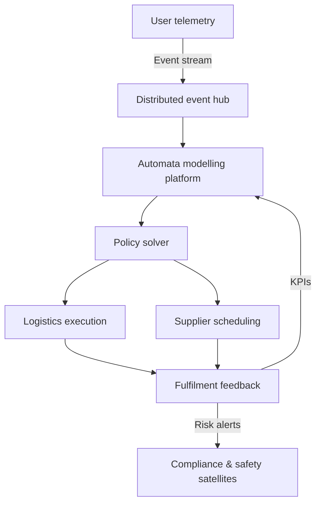

# Pinduoduo Distributed Automata Dynamics Center

> Establish a research hub that links consumer internet demand with real-world supply chains via distributed automata. Close the feedback loop among large-scale compute, real-time logistics, and smart manufacturing so Pinduoduo’s operations, fulfilment efficiency, and industrial collaboration improve in a verifiable way.

## 1. Strategic Mission

- **Zero-distance supply–demand mapping**: Feed consumer signals into factory scheduling and logistics automata within milliseconds, shrinking order-to-delivery latency.
- **Distributed autonomous coordination**: Govern supply nodes, customer-service bots, and marketing engines with formal automata models to avoid siloed strategies destabilising the whole.
- **Industrial belt co-research**: Bring agriculture, manufacturing, and cross-border teams into joint experimentation with validated dynamics models, shared risk alerts, and knowledge assets.

## 2. Organisational Stack

| Layer | Function | Key Roles | Milestone |
| --- | --- | --- | --- |
| Decision council | Set research agenda, evaluate experiments, authorise joint programs | Co-founders, CRO, chief scientist | Launch quarterly “automata index” reviews |
| Dynamics labs | Model logistics, supply-chain finance, growth systems | Dynamics scientists, RL engineers, OR experts | Identify 12 cross-domain state/parameter models |
| Automata ops center | Run online automata services, manage A/B validations, integrate business systems | SREs, data PMs, industrial liaisons | Implement automated rollbacks and safety sandboxes |
| Industrial co-creation nodes | Deploy in industrial belts, co-validate models, inject local constraints | Local governments, partner factories, cooperatives | Establish 30+ direct data pipelines |

## 3. Technical Architecture

- **Distributed event hub**: Multi-active messaging bus (Pulsar + Kafka) absorbing async events from app, voice agents, and IoT warehouses.
- **Automata modelling platform**: DSL to encode inventory, transport, and cashflow transitions; verify constraints via Coq/Isabelle modules.
- **Policy solver**: Hybrid RL + convex optimisation to output energy constraints, safe inventory zones, delivery sequencing.
- **Fulfilment loop**: Drones, AGVs, and human checkpoints stream telemetry; Kalman/particle filters refine state estimates.

## 4. Research Themes

1. **Distributed automata consistency**: Protocols for state coherence across regions and edge nodes with self-healing after outages.
2. **Supply-chain stability**: Nonlinear models including production lags, replenishment cycles, demand elasticity; analyse Lyapunov stability.
3. **Semantic collaborative intelligence**: Treat CS bots, merchant chat, and agronomist advice as language automata; inject semantic constraint vectors into action policies.
4. **Green fulfilment energy scheduling**: Model renewable assets as energy states and apply optimal control for carbon–cost Pareto frontiers.

## 5. Data & Compute Infrastructure

| Component | Capability | Metric |
| --- | --- | --- |
| Real-time lake | Integrates 200+ sources and warehouse sensors with millimetre tracking | Latency ≤ 2 s; ≥150B events/day |
| Automata simulation cluster | GPU+FPGA mix supporting 100k replays per hour | ≤90 s per run; 1200 sims/min |
| Trusted execution | Confidential computing + differential privacy for partner data | ε ≤ 1.2; 100% audit logging |
| Unified metric platform | Aggregates fulfilment, risk, CX metrics with tiered access | ≤30 s refresh; 99.99% availability |

## 6. Collaboration Network

- **Industrial-belt fleets**: Dedicated “automata fleets” collect policy shifts, seasonal supply/demand, manufacturing processes.
- **Cross-market experiments**: Share interfaces with Temu international to adapt models for differing tariffs and logistics.
- **Academic alliance**: Partner with universities in control, OR, and agri-engineering for open topics and publication/transfer pipelines.

## 7. Safety & Compliance

- Formal verification ensures financial automata respect cashflow safety even under stress scenarios.
- Tiered access plus federated supplier identity prevents leakage or misuse.
- Ethics board evaluates impacts on smallholders and labour rights.

## 8. Metrics

| Metric | Target | Description |
| --- | --- | --- |
| Automata convergence latency | ≤ 500 ms | Time from demand event to actionable policy output |
| Supply-chain stability index | ≥ 0.92 | Composite of inventory variance, delay, replenishment cycle |
| Risk response time | ≤ 2 min | Risk satellite to business mitigation loop |
| Industrial participation | ≥ 85% | Active data submission ratio per belt |
| Carbon efficiency gain | ≥ 12% | Energy reduction vs. baseline under green fulfilment |

## 9. Roadmap

1. **T0 (0–3 months)**: Finalise agenda, recruit core team, procure compute; launch minimal event hub.
2. **T1 (3–9 months)**: Deliver initial logistics, finance, and CS automata; enable cross-domain signals; start five belt pilots.
3. **T2 (9–18 months)**: Automata drive ≥80% fulfilment volume; deploy green energy scheduling; launch global control cockpit.
4. **T3 (18+ months)**: Open model APIs and sandboxes for partners; create certification standards.

## 10. Automata Governance Appendix

- **Policy audits** via GitOps with independent reviewers validating transition matrices.
- **Rollback** using regional blue/green deployments; revert immediately if metrics slip.
- **Knowledge base integration**: Models, scripts, and cases feed into the Earth Online knowledge base for continuous navigation updates.
