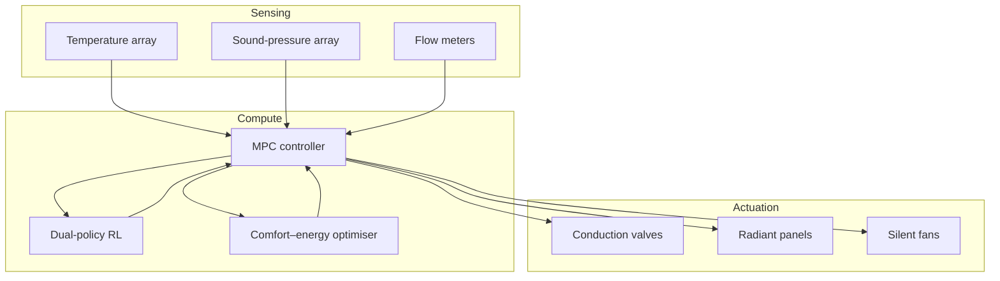

# Tomoko & Yuko Thermal Dual-Resonance Lab

> Build a multi-physics cabin centred on heat–acoustic coupling. Using dual thermal resonators, reconfigurable conduction networks, and coordinated control algorithms, validate reversible thermal management in dense urban environments.

## 1. Objectives

- **Bidirectional thermal dispatch**: Switch between heating and cooling within 10 seconds by reconfiguring energy flow.
- **Multibody coupling**: Maintain ≤0.8 °C difference across six thermal nodes to keep dual resonance stable.
- **Cooperative operation**: Generate room-level control policies under constraints on comfort, noise, and energy cost.

## 2. Cabin Layers

| Section | Function | Core Components |
| --- | --- | --- |
| Resonance core | Thermal resonator with acoustic cavity for heat–sound energy exchange | Titanium dual resonators, MEMS transducers, active damping |
| Topology network | Programmable conduction paths for real-time routing | Phase-change modules, graphene sheets, micro-valve arrays |
| Environmental interface | Link to air, surfaces, and users | Radiant panels, floor heating/cooling loops, temp/humidity/sound sensors |
| Control deck | Computation and safety interlocks | RISC-V controller, FPGA coprocessor, TSN backplane |

## 3. Control Architecture

- **Model predictive control** solves coupled heat–acoustic equations every 500 ms to set valve openings and panel power.
- **Dual RL** refines resonance frequency and damping policies via online exploration and offline simulations for material robustness.
- **Multi-objective optimisation** balances PPD, sound level, and power consumption with dynamic weights.

## 4. Test Procedure

1. **Baseline modelling**: IR mapping and acoustic scans generate coupled thermal/acoustic models.
2. **Node calibration**: Pulse tests with micro-heaters/coolers calibrate sensor response.
3. **Resonance tuning**: Adjust cavity geometry and damping layers to lock resonance at 420 Hz.
4. **Policy deployment**: Run MPC+RL control with user comfort feedback for 48-hour closed-loop tests.

## 5. Data & Interfaces

- Topics: `thermal-lab/<zone>/<node>/<metric>`; metrics include temperature, acoustic, flow, energy.
- Visualisation: web dashboards for heat vectors, sound isosurfaces, energy stats with 10-minute replay.
- APIs: gRPC endpoints for external strategies with sandboxing and rollback.

## 6. Safety & Compliance

- Cap high-temp nodes at 80 °C with 200 ms circuit protection.
- Sound maintained below 55 dB(A) to meet residential/office norms.
- End-to-end encryption and role-based access control for data links.

## 7. Metrics

| Metric | Target | Notes |
| --- | --- | --- |
| Dual resonance stability | ≤ ±0.2 dB | Amplitude variation of heat–sound resonance |
| Energy recycling efficiency | ≥ 87% | Share of recovered heat reused |
| Comfort score | ≥ 85 | Combined occupant survey and PPD model |
| Self-healing time | ≤ 6 s | Time to restore target temperature after disturbances |

## 8. Next Iterations

- Introduce liquid-metal microchannels and programmable microbubbles for faster conduction.
- Develop scenario libraries for museums and data centres to broaden deployments.
- Integrate with city energy platforms to coordinate inter-building heat sharing.

## 9. Convex Thermal Flow Orchestration

- **Decision vector**: \(x = [p_1, …, p_6, u_1, …, u_3]^\top\) for node power and acoustic/valve controls.
- **Objective**:
  \[
  \min_{x} \; \mu_1 \lVert Hx - t_{\text{ref}} \rVert_2^2 + \mu_2 \lVert Sx - s_{\text{ref}} \rVert_2^2 + \mu_3 \lVert x \rVert_1,
  \]
  with \(H\) and \(S\) the thermal/acoustic response matrices and \(t_{\text{ref}}, s_{\text{ref}}\) target profiles.
- **Constraints**:
  - Power bounds: \(0 \le p_i \le p_i^{\max}\).
  - Comfort band: \(Tx \in [t_{\text{min}}, t_{\text{max}}]\).
  - Noise cone: \(\lVert Qx \rVert_2 \le \delta\).
- **Solution**: Solve a convex QP each control cycle; on embedded targets, use ADMM to split per node and exchange multipliers over TSN.
