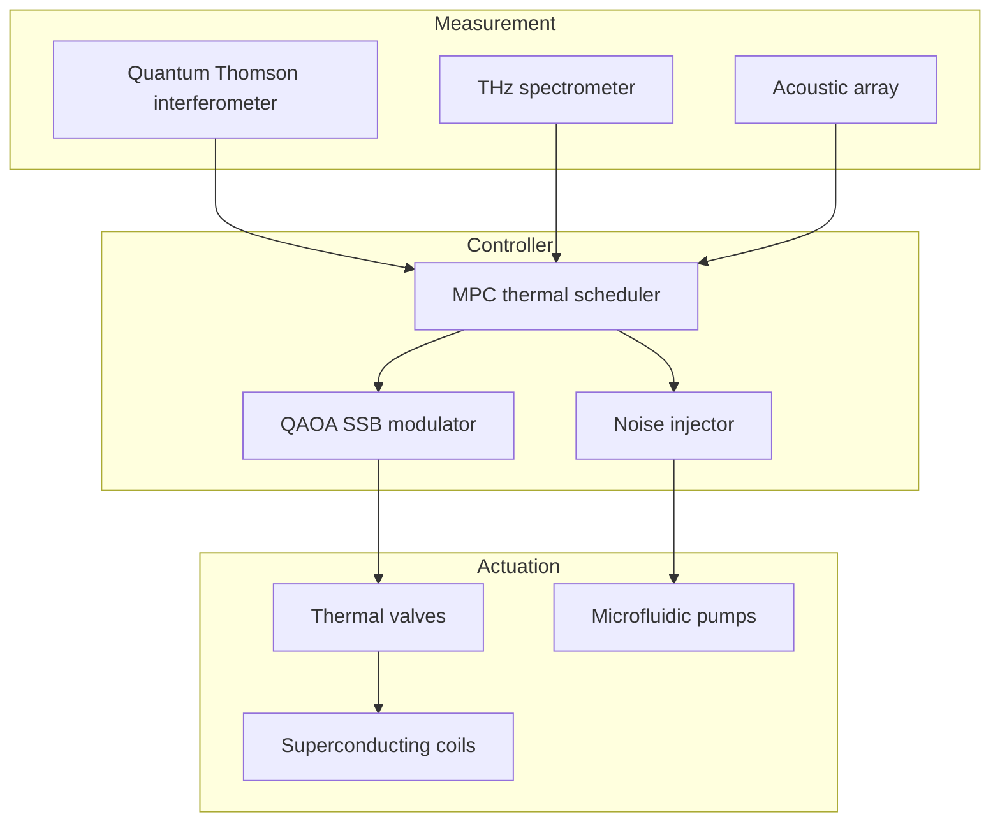

# V- and D-Particle Thermal Dual Spontaneous Symmetry Breaking Plan

> Build a dual quantum-field platform coupling v- and d-modes under thermal duality. Using tunable topological conduction networks and symmetry-constrained controllers, observe how spontaneous symmetry breaking (SSB) emerges near thermal equilibrium.

## 1. Research Goals

- **Thermal-dual SSB mapping**: Enforce \(T_v T_d = T_0^2\) inside dual-mode cavities and track the symmetry-breaking path of the order parameters.
- **Quantum–classical hybrid control**: Inject Boltzmann noise into quantum modulators to verify the noise-triggered SSB distribution.
- **Observable spectra**: Collect data across 0.1–5 THz (THz window) and 20–200 kHz (acoustic submodes) to build spectral topology maps.

## 2. Model Setup

- **Fields**:
  - \(\phi_v(\mathbf{r}, t)\): phonon-guided quasiparticle mode (v-field).
  - \(\phi_d(\mathbf{r}, t)\): diffusion-dominated dissipative mode (d-field).
  - Constraint \(\phi_v \phi_d = \phi_0^2\) encodes thermal duality.
- **Effective Lagrangian**:
  \[
  \mathcal{L} = \sum_{x \in \{v,d\}} \left[ \frac{1}{2}\partial_\mu \phi_x \partial^\mu \phi_x - \frac{\alpha_x}{2} \phi_x^2 - \frac{\beta_x}{4} \phi_x^4 \right] - \gamma \phi_v^2 \phi_d^2 - \eta(T_v T_d - T_0^2).
  \]
- **Order parameters**: \(m_v = \langle \phi_v \rangle\), \(m_d = \langle \phi_d \rangle\), with \(m_v m_d = m_0^2\).

## 3. Thermal-Dual Cavity Design

| Subsystem | Structure | Key Parameters |
| --- | --- | --- |
| Dual-mode resonator | Coupled microcavities (titanium + graphene) with MEMS thermal valves | \(\omega_v/2\pi = 0.8\) THz, \(\omega_d/2\pi = 32\) kHz |
| Thermal-dual bridge | Liquid-metal microchannels + phase-change materials enforcing \(T_v T_d = T_0^2\) | Control error ≤0.3% |
| Topological conduction array | 16×16 programmable nodes with FPGA-driven MEMS switches | Switching time ≤150 µs |

## 4. Control System

- **MPC** solves heat equations every 1 ms to set valve openings and pump speeds.
- **QAOA modulator** maps v/d frequencies and pump phases into gate sequences to track bifurcations in the order parameters.
- **Noise injector** synthesises controlled noise from temperature gradients and acoustic perturbations to tune SSB probability.

## 5. Experimental Procedure

1. **Dual calibration**: Superconducting probes verify \(T_v T_d = T_0^2\) within ±0.2%.
2. **Ground-state prep**: Activate liquid-metal bridge at zero bias to initialise \(m_v = m_d = m_0\).
3. **Adiabatic drive**: Increase v-pump power while applying reverse drive on d-field to observe order-parameter splitting.
4. **Noise scan**: Adjust noise amplitude logarithmically and record SSB probability plus spectral shifts.
5. **Data loop**: Feed observations back into MPC/QAOA for iterative retuning.

## 6. Data & Interfaces

- Telemetry topics: `thermal-dual-ssb/<run>/<sensor>/<metric>` with metrics like temperature, order_param, spectrum, noise_level.
- Format: Parquet at 1 kHz including density matrices from state reconstruction.
- Interfaces: gRPC streaming and WebAssembly SDK for external algorithms and visualisation.

## 7. Order-Parameter Monitoring

| Metric | Target | Description |
| --- | --- | --- |
| \(\tau_{\mathrm{SSB}}\) | ≤4 ms | Time for order parameter to deviate 10% from \(m_0\) |
| Thermal-dual error \(\epsilon_T\) | ≤0.2% | \(|T_v T_d - T_0^2|/T_0^2\) |
| Correlation length \(\xi\) | ≥12 cm | Exponential decay scale of v/d correlation functions |
| Energy recovery | ≥88% | Fraction of energy returned to reservoirs after SSB |

## 8. Safety & Compliance

- Limit superconducting-coil current to 15 A with 100 µs breakers.
- Coat liquid-metal channels with ceramic insulation to prevent shorts.
- Use fibre isolation and QKD encryption between measurement and control rooms.

## 9. Future Work

- Introduce non-Hermitian topological edge states to study non-equilibrium protection of thermal duality.
- Couple the platform to city-scale thermal networks for macro-level strategy transfer.
- Build multimodal dashboards linking v/d spectra with noise-trigger distributions in real time.
