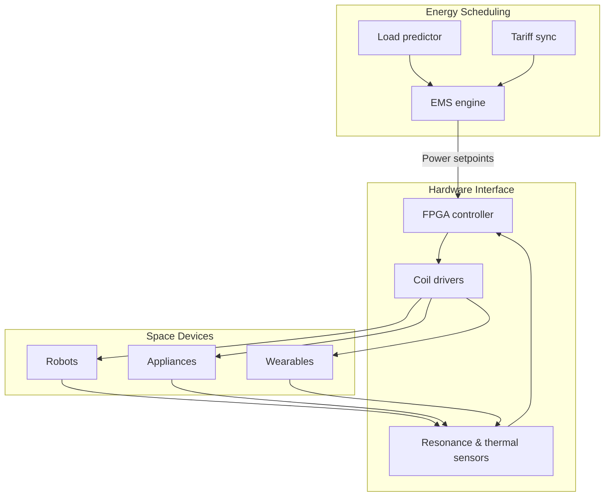

# Whole-Home Intelligent Wireless Charging Lab

> A BIM-driven home energy network that packages resonant coil arrays, energy scheduling, and safety interlocks into a reproducible lab protocol.

## 1. Vision

- **Coverage**: Form a continuous energy field across living room, bedroom, workspace, and parking bay so devices, appliances, and robots receive power anywhere.
- **Deployment velocity**: Modular cabins and standard wiring ducts cut design-to-install time; partial retrofits complete within seven days.
- **Operational transparency**: Dual dashboards for residents and ops teams showing utilisation, resonance stability, and health metrics in real time.

## 2. Cabin Structure

| Module | Description | Key Elements |
| --- | --- | --- |
| Control hub | High-frequency inversion, power management, IoT gateway | FPGA controller, GaN amplifier array, TSN switch |
| Energy waveguide | Resonant cavities & conductors in walls/ceilings | 3 kW coils, flux concentrators, thermal layering |
| Sensing nodes | Embedded chargers and locators in furniture/floors | Qi/PMA transceivers, UWB modules, visual markers |
| Safety shell | Isolation, shielding, fire monitoring | Nonlinear absorbers, IR inspection, smoke/gas dual sensing |

## 3. Control System

- **Predictive scheduling**: Transformer-based load forecasts plus dynamic pricing produce 15-minute ahead power allocations.
- **Adaptive resonance**: FPGA samples at 5 kHz, adjusting LCL matching to keep 6.78 MHz resonance stable.
- **Safety interlock**: UWB positioning detects humans; power derates and shifts to directional beams when proximity is high.

## 4. Experience Interfaces

1. **Resident panel**: AR overlays of energy flow; mobile app shows status and lets users cap power manually.
2. **Ops console**: Web dashboard with heat maps, incident timelines, remote firmware control.
3. **Developer API**: MQTT topics (e.g., `lab/charging/<room>/<device>/power`) for third-party robots to schedule charging slots.

## 5. Experiment Path

- **Phase A — Scanning**: SLAM-based point clouds and material classification guide coil placement.
- **Phase B — Prototype install**: Deploy 12 coil nodes across two rooms with safety interlocks and thermal sensors.
- **Phase C — Closed-loop test**: 72-hour continuous run to log power stability and EM radiation.
- **Phase D — Expansion**: Integrate housekeeping, security, and garage charging for cross-space energy coordination.

## 6. Safety & Compliance

- Comply with IEC 61980; field strength <6.25 µW/cm².
- Redundant thermal + smoke loops cut power within 200 ms on faults.
- End-to-end encryption and zero-trust access; firmware updates require multi-party signatures.

## 7. Metrics

| Metric | Target | Notes |
| --- | --- | --- |
| Energy utilisation | ≥88% | Rolling 24h output/input ratio |
| Thermal stability | ΔT ≤12 °C | Coil vs. structure temperature delta |
| Response latency | ≤50 ms | Dispatch-to-power delay |
| Device coverage | 95% | Devices authenticate within 30 s of entry |

## 8. Next Steps

- Fuse mmWave positioning with vision for better human detection.
- Link with HEMS to coordinate PV, storage, and grid exchanges in real time.
- Build a virtual sandbox for remote testing of schedules and safety scripts.

## 9. Convex Power Scheduling

- **Decision variables**: \(x \in \mathbb{R}^k\) for room–device power, with \(y\) capturing resonance frequency adjustments.
- **Objective**:
  \[
  \min_{x, y} \; \theta_1 \lVert R x - d \rVert_2^2 + \theta_2 \lVert y \rVert_2^2 + \theta_3 \lVert x \rVert_1,
  \]
  where \(R\) routes energy to devices and \(d\) is forecast demand; \(\ell_1\) promotes sparse simultaneous charging.
- **Constraints**:
  - Power capacity: \(0 \le x \le x_{\max}\).
  - Resonance stability: \(\lVert F y \rVert_2 \le \epsilon\).
  - Safety distance: \(Gx \preceq h\) to limit exposure near people.
  - Energy balance: \(Ax = b\) across storage, PV, and grid exchanges.
- **Solution**: Offline interior-point baseline; online fast-gradient/ADMM updates within 100 ms. EMS pushes commands via TSN to the FPGA for closed-loop control.
