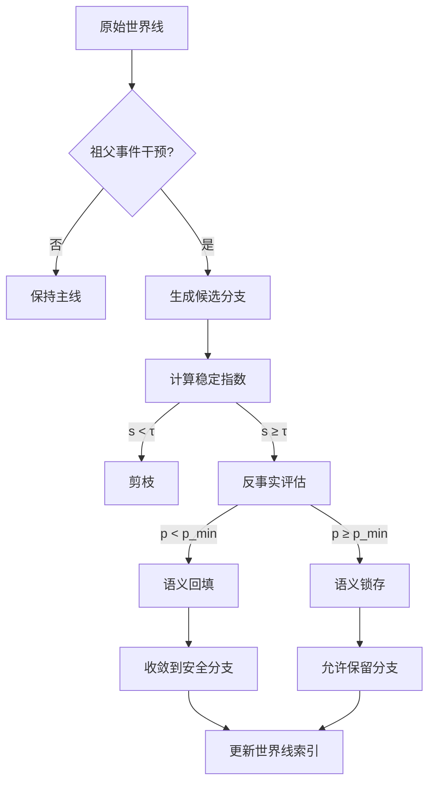

# 祖父悖论与世界线修改的剪枝策略

> 在允许时间旅行的叙事系统中，祖父悖论揭示了因果链条的脆弱性，而有效的剪枝策略则让世界线在可控的分叉树中保持一致性。

## 1. 悖论背景

- **祖父悖论定义**：时间旅行者回到过去阻止祖父存活，从而否定自身存在的自指冲突。
- **世界线视角**：将时间历史建模为带权有向图 \(G = (V, E)\)，节点代表事件，边权代表因果强度或发生概率。
- **冲突成因**：当旅行者对祖父事件执行干预时，导致图中形成自相矛盾的循环（causal cycle），破坏了 \(G\) 的偏序结构。

## 2. 剪枝问题建模

| 元素 | 说明 | 数学描述 |
| --- | --- | --- |
| 世界线树 \(T\) | 从原始历史拓展出的所有可能分支 | 深度优先展开 \(T = (N, A)\) |
| 剪枝操作 | 删除不一致或代价过高的分支 | 选择子集 \(S \subseteq A\) 使得约束满足 |
| 可行性约束 | 避免因果循环，维持旅行者存在性 | \(\forall n \in N,\; f(n) \geq 0\) |
| 代价函数 | 平衡历史偏差与干预资源 | \(J = \alpha C_\text{div} + \beta C_\text{energy}\) |

- **偏差成本 \(C_\text{div}\)**：度量目标世界线与原始历史在关键事件上的差距，可用余弦相似度或 KL 散度。
- **能耗成本 \(C_\text{energy}\)**：执行干预所需的能量或伦理资源，通常与剪掉的分支数量、深度成正比。

## 3. 剪枝策略栈

### 3.1 稳定性门槛策略

1. 计算每个候选分支的因果稳定指数 \(s_i\)。
2. 设置阈值 \(\tau\)，当 \(s_i < \tau\) 时执行剪枝。
3. 通过自适应调整 \(\tau\) 来控制世界线数量，使总风险低于设定预算。

> 适合实时响应的场景，可在发现祖父事件受到破坏时迅速切断不稳定分支。

### 3.2 反事实回填策略

- 构造反事实模拟 \(H_i\)，估计祖父事件被阻断后旅行者仍然存在的概率 \(p_i\)。
- 若 \(p_i\) 低于安全下界 \(p_\text{min}\)，则将该分支回填为 “旅行者失去进入条件”，即强制收敛到旅行者无法执行干预的状态。
- 通过回填降低祖父悖论的自我否定强度，使世界线重新满足因果闭合。

### 3.3 语义锁存策略

- 定义祖父事件的语义标签（血缘、身份、合法继承等）。
- 在世界线树的高层节点上锁存这些语义，禁止对其进行高破坏性的操作。
- 允许旅行者在低风险语义层面进行微调（如改变会面地点），形成可逆的细粒度分支。

## 4. 算法流程示意

- **更新世界线索引**：维护可视化索引或哈希地图，记录每条保留分支的状态、成本与祖父事件关系，方便后续巡检。
- **主线回放**：对保留分支进行周期性回放，确保没有出现潜在的新悖论。

## 5. 指标体系

| 指标 | 描述 | 目标区间 |
| --- | --- | --- |
| 世界线一致性分数 | 剪枝后可行世界线的平均偏序一致度 | ≥ 0.92 |
| 悖论残差指数 | 仍存在的自指矛盾风险 | ≤ 0.05 |
| 干预能耗 | 旅行者干预所耗资源归一化值 | 0.3 – 0.6 |
| 回放成功率 | 主线回放时通过一致性校验的概率 | ≥ 95% |

## 6. 实施建议

- **建立祖父事件的最小可干预单元**：通过语义层划分，明确哪些操作被视为高危剪枝对象。
- **部署多代理协同**：让独立的剪枝代理在不同分支上并行评估稳定度，再通过共识协议选出保留线路。
- **引入伦理权重**：在成本函数中加入伦理负债项 \(C_\text{ethics}\)，避免为了数学一致性而忽视人类价值。
- **记录溯源链路**：为每次剪枝操作生成溯源凭证，包含旅行者身份、干预时间、评估模型版本。

## 7. 展望

- 将剪枝策略扩展到多旅行者博弈，分析当多个旅行者争夺同一祖父事件时的纳什均衡。
- 探索基于量子退相干的自适应剪枝，利用 Decoherence 自然阻断不可能的世界线。
- 与现实世界的因果建模结合，为非时间旅行场景（如政策模拟）提供高鲁棒性的干预方案。
