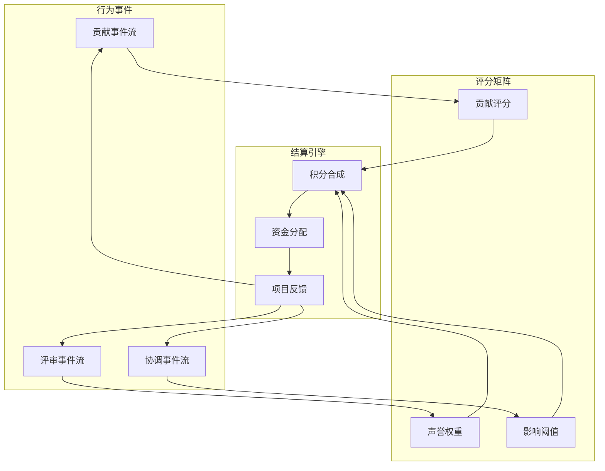

# 微观激励桥实验室

> 构建跨社区的微观激励桥梁，将行为数据、资金流与声誉网络接入统一的结算协议，实现公共项目的精准引导与实时调节。

## 1. 实验愿景

- **公共项目可持续性**：让微小贡献在跨平台、跨社群间被捕捉与放大，形成可持续的公共资产供给。
- **激励透明度**：所有激励规则、权重与结算结果在链上与链下仪表板中同步公开，确保参与者理解收益来源。
- **自适应治理**：借助反馈控制与协作脚本，根据社区状态动态调节激励力度，避免过度补贴或激励滞后。

## 2. 桥梁拓扑

| 组件 | 描述 | 关键要素 |
| --- | --- | --- |
| 行为采集端 | 接入 GitHub、Discord、Notion 等生产与协作平台的事件流 | Webhook 适配器、事件归一化、抗垃圾策略 |
| 激励定价层 | 将贡献行为映射为基础积分，再与声誉与目标函数加权 | 多目标优化、链上预言机、风险缓冲池 |
| 结算桥 | 连接多链钱包、稳定币与法币出入金渠道的自动化节点 | MPC 签名、支付路由、风控引擎 |
| 公共项目池 | 存放待资助的公共项目与 KPI 的治理合约 | 项目白名单、KPI 订阅、动态锁仓 |

## 3. 激励协议

- **贡献评分**：按任务类型设定基准权重，例如代码提交、社区维护、研究写作分别赋予 1.0、0.6、0.8 的贡献系数，并结合完成度与及时性调整。
- **声誉权重**：通过去中心化身份（DID）与历史贡献记录构建声誉区间；高声誉成员触发质押倍增，低声誉成员需通过验证期提升权重。
- **影响阈值**：公共项目方设定最小可见度与影响指数，当贡献未达阈值时由缓冲池补贴，当超过阈值时逐步降低边际激励以防泡沫。

## 4. 数据流与指标

1. **事件集成**：每 10 秒轮询事件队列，利用分层缓存减少相同贡献的重复记账。
2. **实时结算**：结算引擎基于滚动 5 分钟窗口执行积分合成，并以 zk 证明确保敏感数据匿名化。
3. **反馈回路**：项目方仪表板展示资金流向、贡献热力图与 KPI 达成率，成员收到个性化提示与下一步推荐任务。

## 5. 运营流程

- **阶段 A — 接入试点**：选取 3 个公共项目，部署行为采集端与基础积分模型，校验数据完整度。
- **阶段 B — 多桥联动**：开启多链结算桥，将稳定币收益自动兑换为项目所需货币，实现跨地区支付。
- **阶段 C — 自适应调节**：上线 PID 控制策略，根据项目 KPI 偏差调节激励幅度，确保资金使用效率。
- **阶段 D — 治理共识**：引入社区投票模板，允许成员调整权重矩阵与项目池白名单。

## 6. 安全与合规

- 采用多方计算签名与限额策略，单次出款超过阈值需多签确认。
- 所有事件记录与结算结果同步写入不可篡改日志，支持审计与追溯。
- 符合当地监管的 KYC/AML 要求，敏感数据通过隐私计算网关脱敏。

## 7. 指标面板

| 指标 | 目标 | 说明 |
| --- | --- | --- |
| 贡献确认时延 | ≤ 45 秒 | 从事件触发到积分确认的总延迟 |
| 激励利用率 | ≥ 92% | 实际发放资金 / 预算资金的滚动 30 日比率 |
| 资金安全事件 | 0 次 | 单个结算窗口内的异常或欺诈事件 |
| 项目 KPI 达成度 | ≥ 85% | 项目方提交的 KPI 达成率加权平均 |

## 8. 下一步

- 接入行为预测模型，提前识别潜在贡献空档并推送任务提示。
- 打通 DAO 与城市公益基金，实现链上与线下资产的协同治理。
- 构建开源协议套件，让其他社区一键部署微观激励桥实验室。

## 9. 凸优化激励编排

- **决策变量**：为每个贡献者定义激励分配向量 \(x \in \mathbb{R}^m\)，元素包含稳定币补贴、积分增益与声誉倍增系数。
- **目标函数**：
  \[
  \min_{x} \; \lambda_1 \lVert P x - g_\text{target} \rVert_2^2 + \lambda_2 \operatorname{KL}(q(x) \Vert q_0),
  \]
  其中 \(P\) 为项目贡献影响矩阵，\(g_\text{target}\) 表示 KPI 目标，\(q(x)\) 是由 \(x\) 诱导的贡献者激励分布，用 KL 散度保持与基准策略 \(q_0\) 的一致性。
- **约束条件**：
  - 预算约束：\(\mathbf{1}^\top x \leq B\)。
  - 公平性：\(Ax \succeq b\)，确保边缘群体获得最低激励阈值。
  - 风险暴露：二阶锥约束 \(\lVert 
    \Sigma^{1/2} x \rVert_2 \leq \sigma_\text{max}\) 限制资金波动。
- **求解策略**：使用分布式原始-对偶内点法在链下求解，再通过多签哈希提交到链上合约；在 5 分钟滚动窗口内运行快速次优解（如 ADMM）以响应实时事件队列。
