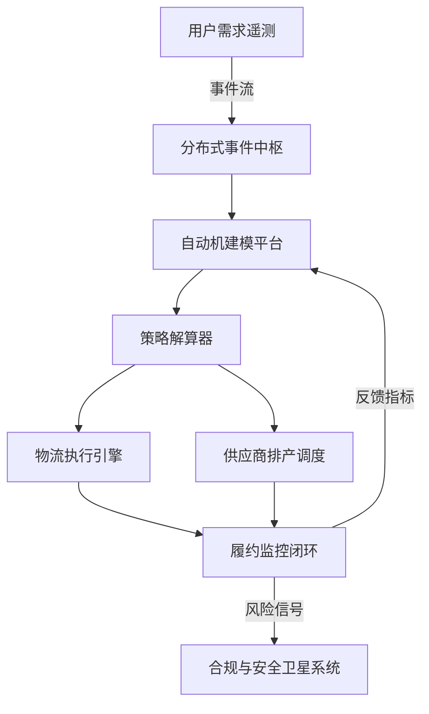

# 拼多多分布式自动机动力系统研究中心

> 建立一座面向消费互联网与实体供应链的分布式自动机动力系统研究枢纽，在大规模分布式算力、实时物流网络与智能制造节点之间构建反馈闭环，使拼多多的运营策略、履约效率与产业协同能力得到持续可验证的提升。

## 1. 战略使命

- **零距离供需映射**：让消费者需求信号在毫秒级传入工厂排产与物流调度自动机，缩短从下单到交付的时延。
- **分布式自治协同**：以自动机形式化模型治理供应链节点、客服机器人与营销策略引擎，避免孤岛策略导致的全局失衡。
- **产业带共研平台**：把农业、制造业与跨境团队纳入联合研究，以可验证的动力系统模型共享最佳实践、风险告警与知识资产。

## 2. 组织结构分层

| 层级 | 职能 | 关键角色 | 成熟度里程碑 |
| --- | --- | --- | --- |
| 决策议会 | 设定研究议题、评估实验成果、授权产业带共研 | 联合创始人、CRO、首席科学家 | 建立季度“自动机指数”评估体系 |
| 动力系统实验室群 | 拆解物流、供应链金融、用户增长等领域的动态模型 | 动力系统科学家、强化学习工程师、运筹学专家 | 完成 12 条跨域模型的状态观测与参数识别 |
| 自动机运营中心 | 维护在线自动机服务、部署 A/B 验证、联通业务系统 | SRE、数据产品经理、产业带联络官 | 建立自动化回滚与安全沙箱 |
| 产业共创节点 | 落地于多地产业带，联合验证模型，反馈本地约束条件 | 产业带政府、合作工厂、农业合作社 | 打通 30+ 条直连数据采集链路 |

## 3. 技术架构

- **分布式事件中枢**：采用多活消息总线（如 Pulsar + Kafka 联合部署）吸收来自 App、语音客服、IoT 仓储的异步事件。
- **自动机建模平台**：提供 DSL 描述库存、运输、现金流的状态转移函数；基于 Coq/Isabelle 模块校验关键约束。
- **策略解算器**：结合强化学习与凸优化求解器，输出能量约束、库存安全区与配送顺序。
- **履约监控闭环**：利用无人机、AGV 与人工节点上传的遥测数据，以 Kalman 滤波/粒子滤波修正状态估计。

## 4. 核心研究方向

1. **分布式自动机一致性**：研究在跨区域数据中心与边缘计算节点上保持状态一致的协议，支持断网自恢复。
2. **供应链动力系统稳定性**：构建包含生产滞后、补货周期与需求弹性的非线性模型，分析李雅普诺夫稳定域。
3. **语义协同智能**：把客服问答、商家沟通与农资专家建议作为语言自动机，通过语义约束向量注入行动策略。
4. **绿色履约能源调度**：把新能源站点纳入物流自动机的能量状态变量，联合最优控制实现碳排与成本的Pareto 前沿。

## 5. 数据与算力基础设施

| 组件 | 能力 | 关键指标 |
| --- | --- | --- |
| 实时数据湖 | 对接 200+ 业务数据源与仓储传感器，支持毫米级定位 | 延迟 ≤ 2 秒，日写入事件量 ≥ 1500 亿 |
| 自动机仿真集群 | GPU + FPGA 混合算力，支撑小时级 10 万次仿真回放 | 单次仿真 ≤ 90 秒，吞吐 1200 次/分钟 |
| 可信执行环境 | 为敏感商家数据提供机密计算与差分隐私 | DP 噪声 ε ≤ 1.2，审计日志 100% 留存 |
| 统一指标中台 | 聚合履约、风控、用户体验指标并提供分层权限 | 指标刷新 ≤ 30 秒，99.99% 可用性 |

## 6. 运营协同网络

- **产业带联络舰队**：每个重点产业带设立“自动机舰队”，负责采集本地政策、季节性供需与生产工艺。
- **跨境协同实验**：与 Temu 国际站共享自动机模型接口，对不同关税、物流模式进行参数化适配。
- **高校与研究机构联盟**：与自动控制、运筹学、农业工程高校共建开放课题，建立发表与转化双向通道。

## 7. 安全与合规治理

- 通过形式化验证确保金融自动机在极端情境下不会突破现金流安全阈值。
- 建立多级访问控制与供应商端身份联邦认证，防止数据泄露与模型滥用。
- 设立伦理审查委员会，评估自动化决策对小农户、工人权益的潜在影响。

## 8. 度量指标体系

| 指标 | 目标值 | 解释 |
| --- | --- | --- |
| 自动机收敛时延 | ≤ 500 ms | 从需求事件触发到策略解算器输出有效决策的时间 |
| 供应链稳定度指数 | ≥ 0.92 | 基于库存波动、交付延迟与补货周期构建的组合指标 |
| 风险异常响应时间 | ≤ 2 min | 风险卫星系统到业务处置的闭环时间 |
| 产业带参与度 | ≥ 85% | 入驻产业带中按月提交数据的比例 |
| 碳效率改善率 | ≥ 12% | 绿色履约策略对标基线的能源消耗下降比例 |

## 9. 推进路线图

1. **T0 - 基础筹建（0-3 个月）**：完成研究议题梳理、核心团队组建与算力资源采购；上线事件中枢最小可用架构。
2. **T1 - 多域模型共振（3-9 个月）**：交付首批物流、金融、客服自动机模型并实现跨域信号互通；启动 5 个产业带试点。
3. **T2 - 全链路闭环（9-18 个月）**：自动机策略覆盖 80% 履约量，构建绿色能源调度子系统；上线全局监控指挥舱。
4. **T3 - 联邦共研（18 个月以上）**：开放模型接口与数据沙箱，与生态伙伴共建联合实验；形成标准化认证体系。

## 10. 附录：自动机治理协议

- **策略审计**：所有自动机策略提交 GitOps 管线，由独立审计器复核状态机转移矩阵。
- **回滚机制**：定义跨区域蓝绿发布策略，任何性能指标低于阈值即刻回滚至稳定版本。
- **知识库联动**：研究中心输出的模型、脚本与案例进入 Earth Online 知识库，形成可持续迭代的航线图。
