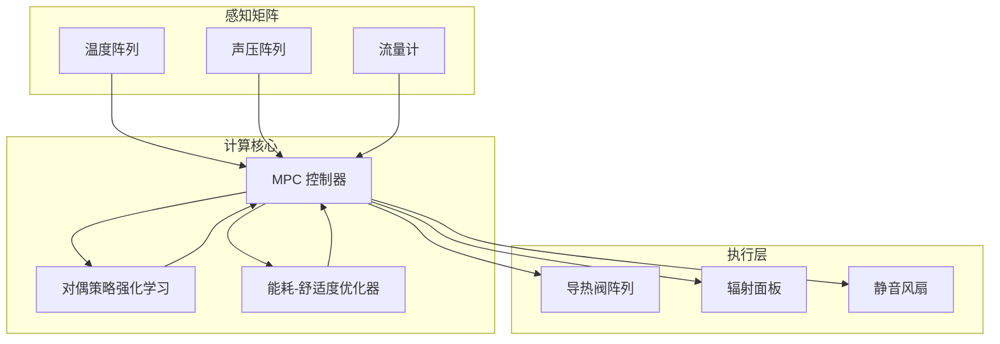

# 朋子和友子的热对偶共振实验室

> 建立以热流-声波耦合为核心的多物理量实验舱，通过热对偶共振腔体、拓扑可编程导热网络与协同调度算法，验证城市高密度环境中的可逆热管理方案。

## 1. 实验目标

- **双向热调度**：实现供热与制冷的快速切换，10 秒内完成能量流重构。
- **多体耦合**：在 6 个热节点之间维持 ≤ 0.8℃ 的温差，保持对偶共振稳定。
- **协同运行**：以热舒适指数、噪声阈值与能耗成本为约束，自动生成房间级控制策略。

## 2. 舱体分层

| 舱段 | 功能 | 核心组件 |
| --- | --- | --- |
| 共振核心 | 带有声腔辅助的热对偶谐振器，实现热量与声能的能量互换 | 钛合金双层谐振腔、MEMS 声换能器、主动阻尼层 |
| 拓扑导热网 | 可重构的导热路径阵列，支持实时切换热流通道 | 相变导热模块、石墨烯导热片、微型阀阵列 |
| 环境交互层 | 与空间空气、家具表面及用户接口联动 | 辐射面板、地暖/冷却管道、温湿度/声压传感器 |
| 控制甲板 | 统一的控制与算力平台，负责算法执行与安全联锁 | RISC-V 控制板、FPGA 协处理、TSN 通信背板 |

## 3. 控制系统架构

- **模型预测控制 (MPC)**：以 500 ms 周期解算热传导与声耦合方程，输出阀门开度与面板功率。
- **对偶强化学习**：通过线上探索与离线仿真数据更新共振频率与阻尼控制策略，保障不同材质空间的适配性。
- **多目标优化**：将 PPD (Predicted Percentage Dissatisfied)、声压级与功率消耗纳入目标函数，实时调整权重。

## 4. 试验流程

1. **基线建模**：对实验空间进行红外测绘与声学扫描，生成热力-声场耦合模型。
2. **节点标定**：以微型加热器与冷端模块对 6 个节点进行脉冲测试，校准传感器响应。
3. **共振调谐**：调节声腔几何与阻尼层厚度，使得热-声共振频率锁定在 420 Hz。
4. **策略上线**：部署 MPC+RL 组合控制并接入用户舒适度反馈通道，进行 48 小时闭环测试。

## 5. 数据与接口

- **数据主题**：`thermal-lab/<zone>/<node>/<metric>`，metric 包括 `temperature`、`acoustic`, `flow`, `energy`。
- **可视化仪表**：Web 仪表盘展示热流向量场、声压等值面与能耗统计，支持回放任意 10 分钟窗口。
- **开发接口**：提供 gRPC 服务用于外部策略试验，支持一次性沙箱与回滚机制。

## 6. 安全与合规

- 所有高温节点设定 80℃ 硬件上限，并在 200 ms 内触发断路保护。
- 声压控制在 55 dB(A) 以下，满足居住/办公空间噪声标准。
- 数据链路采用端到端加密并启用基于角色的访问控制。

## 7. 量化指标

| 指标 | 目标 | 说明 |
| --- | --- | --- |
| 热对偶稳定度 | ≤ ±0.2 dB | 声-热共振幅度波动范围 |
| 能量循环效率 | ≥ 87% | 热能回收与再利用占比 |
| 舒适度得分 | ≥ 85 | 住户/成员问卷与 PPD 模型结合评分 |
| 自愈时间 | ≤ 6 s | 异常扰动后恢复目标温度所需时间 |

## 8. 下一步迭代

- 引入液态金属微通道与可编程微泡阵列，提升导热网络的响应速度。
- 开发针对博物馆与数据中心的场景化策略库，扩展实验舱的部署对象。
- 与城市能源管理平台对接，探索多建筑之间的热量互济调度。

## 9. 凸优化热流编排

- **决策变量**：设定向量 \(x = [p_1, \dots, p_6, u_1, \dots, u_3]^\top\)，前 6 个元素为节点供能功率，后三个元素为声学驱动与阀门调节系数。
- **目标函数**：
  \[
  \min_{x} \; \mu_1 \lVert Hx - t_\text{ref} \rVert_2^2 + \mu_2 \lVert Sx - s_\text{ref} \rVert_2^2 + \mu_3 \lVert x \rVert_1,
  \]
  其中 \(H\) 与 \(S\) 分别为热场、声场响应矩阵，\(t_\text{ref}\) 与 \(s_\text{ref}\) 为目标温度与声压剖面。
- **约束条件**：
  - 功率安全：\(0 \leq p_i \leq p_i^{\max}\)。
  - 热舒适：线性约束 \(T x \in [t_\text{min}, t_\text{max}]\) 确保空间温度在允许区间。
  - 噪声锥：\(\lVert Qx \rVert_2 \leq \delta\) 限制声压级。
- **求解策略**：在每个控制周期运行凸二次规划（QP）求解主问题；若需在嵌入式硬件上实现，可采用交替方向乘子法（ADMM）分解为节点本地子问题，再通过 TSN 总线交换乘子以实现分布式热流编排。
