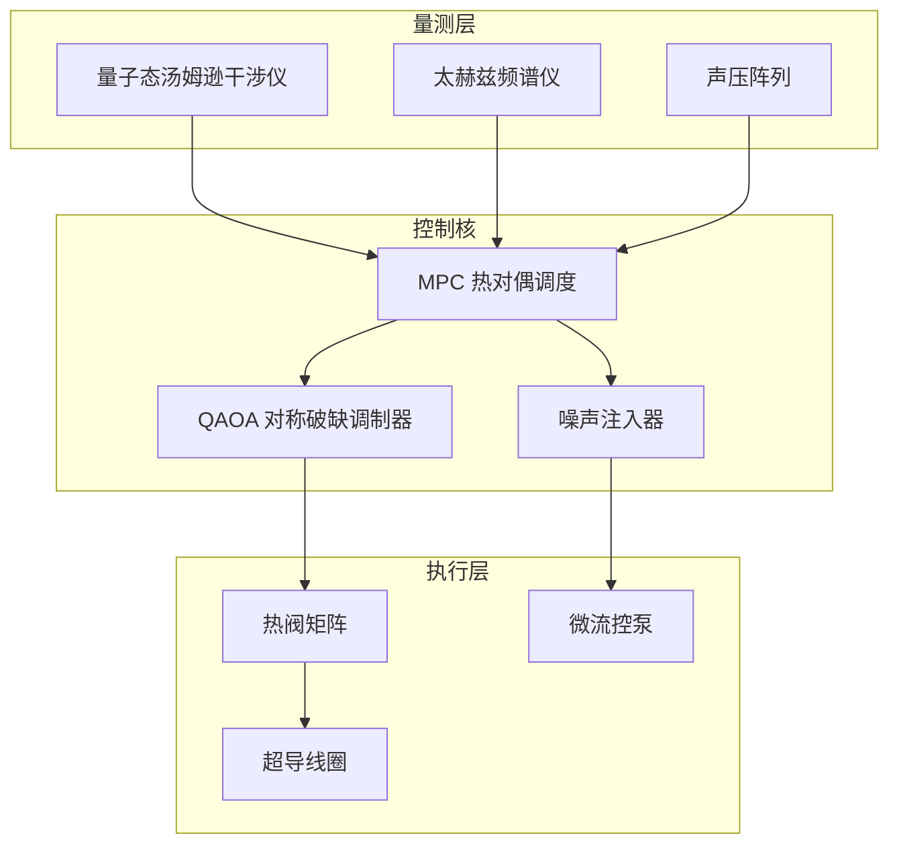

# v 子与 d 子的热对偶自发对称破缺计划

> 构建一个在热对偶条件下耦合的 v 子- d 子双量子场平台，通过可调谐的拓扑热导网络与群论约束的控制器，演示自发对称破缺在热平衡点附近的转迁行为与观测信号。

## 1. 研究目标

- **热对偶 SSB 映射**：在双模腔体中实现 \(T_v T_d = T_0^2\) 的热对偶约束，观测 v/d 子序参量的自发对称破缺路径。
- **量子-经典混合控制**：设计可将玻尔兹曼噪声注入量子调制器的控制器架构，验证噪声触发的对称破缺概率分布。
- **可观测谱系**：在 0.1–5 THz 的太赫兹窗口与 20–200 kHz 的声学副模内完成同步采集，输出谱系拓扑图。

## 2. 模型设定

- **场变量**：
  - v 子场 \(\phi_v(\mathbf{r}, t)\)，代表声子导向的准粒子模式；
  - d 子场 \(\phi_d(\mathbf{r}, t)\)，代表扩散主导的耗散模式；
  - 约束 \(\phi_v\phi_d = \phi_0^2\) 体现热对偶关系。
- **有效拉氏量**：
  \[
  \mathcal{L} = \sum_{x \in \{v,d\}} \left[ \frac{1}{2}\partial_\mu \phi_x \partial^\mu \phi_x - \frac{\alpha_x}{2} \phi_x^2 - \frac{\beta_x}{4} \phi_x^4 \right] - \gamma \phi_v^2 \phi_d^2 - \eta(T_v T_d - T_0^2).
  \]
- **序参量**：\(m_v = \langle \phi_v \rangle,\; m_d = \langle \phi_d \rangle\)，满足 \(m_v m_d = m_0^2\) 的热对偶约束。

## 3. 热对偶腔体设计

| 子系统 | 结构 | 关键参数 |
| --- | --- | --- |
| 双模谐振腔 | 两个共享壁面的微腔，以钛合金与石墨烯复合材料制成，内嵌 MEMS 热阀 | 共振频率 \(\omega_v/2\pi = 0.8\,\text{THz}\)，\(\omega_d/2\pi = 32\,\text{kHz}\) |
| 热对偶桥 | 液态金属微通道与相变材料组合，强制满足 \(T_v T_d = T_0^2\) | 控制误差 ≤ 0.3% |
| 拓扑热导阵列 | 16×16 的可重构导热节点，以 FPGA 控制的 MEMS 微开关切换路径 | 交换时间 ≤ 150 µs |

## 4. 控制系统

- **MPC 热对偶调度**：以 1 ms 周期解算热流方程，输出阀门开度与微流控泵速。
- **QAOA 调制器**：将 v 子场与 d 子场的角频率、泵浦相位映射成量子门序列，追踪序参量的分岔点。
- **噪声注入器**：根据温度梯度与声场扰动生成受控噪声，调整对称破缺触发率。

## 5. 实验流程

1. **对偶标定**：使用超导温度探针标定两个子腔的温度曲线，确认 \(T_v T_d = T_0^2\) 在 ±0.2% 内成立。
2. **基态制备**：在零偏压条件下激活液态金属桥，建立对称基态 \(m_v = m_d = m_0\)。
3. **渐进驱动**：逐步提升 v 子泵浦功率，同时对 d 子施加反向驱动，观察序参量分裂。
4. **噪声扫描**：按对数尺度调节噪声强度，记录自发对称破缺概率与谱线迁移。
5. **数据闭环**：将观测数据回写至 MPC 与 QAOA，迭代更新控制参数。

## 6. 数据结构与接口

- **遥测主题**：`thermal-dual-ssb/<run>/<sensor>/<metric>`，metric 包括 `temperature`、`order_param`、`spectrum`、`noise_level`。
- **数据格式**：全部使用 Parquet，支持 1 kHz 的采样率并附带量子态重构的密度矩阵块。
- **接口**：提供 gRPC streaming API 与 WebAssembly SDK，用于外部算法接入与实时可视化。

## 7. 序参量监测

| 指标 | 目标 | 描述 |
| --- | --- | --- |
| 对称破缺时间 \(\tau_{\mathrm{SSB}}\) | ≤ 4 ms | 序参量偏离 \(m_0\) 10% 的响应时间 |
| 热对偶误差 \(\epsilon_T\) | ≤ 0.2% | \(\frac{|T_v T_d - T_0^2|}{T_0^2}\) |
| 关联长度 \(\xi\) | ≥ 12 cm | v/d 子场关联函数的指数衰减尺度 |
| 能量回收率 | ≥ 88% | 对称破缺后能量回收至热库的比例 |

## 8. 安全与合规

- 设定超导线圈电流上限 15 A，并在 100 µs 内触发硬件断路器。
- 液态金属通道外覆陶瓷绝缘层，防止泄漏造成短路。
- 量子测量装置与控制室之间采用光纤隔离与量子密钥分发加密。

## 9. 迭代展望

- 引入非厄米拓扑边界态，以观察热对偶在非平衡态的拓扑保护。
- 与城市级热网模型耦合，探索大尺度热对偶调度的策略移植。
- 开发跨模态可视化界面，将 v/d 子谱系与噪声触发分布整合进实时仪表板。
