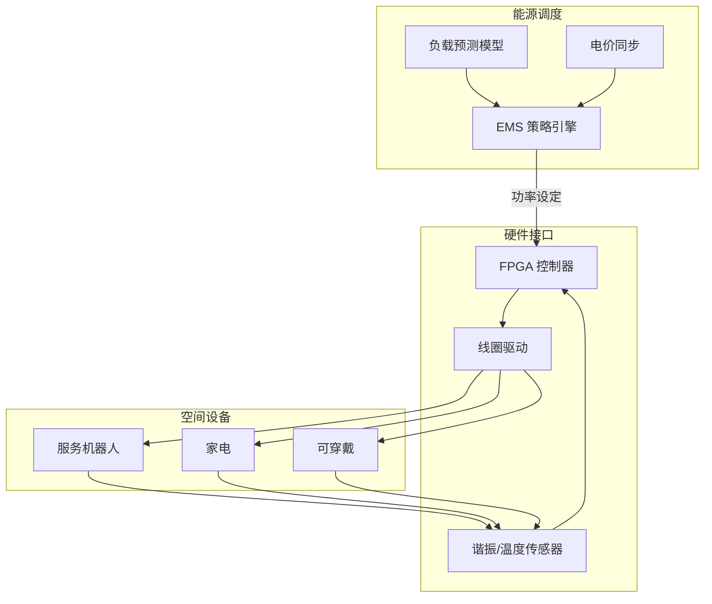

# 全屋智能无线充电实验舱

> 以 3D 建筑信息模型驱动的家庭空间能源网络，将无线充电线圈阵列、能量调度算法与安全联锁打包成可复制的实验舱协议。

## 1. 实验愿景

- **场景覆盖**：让客厅、卧室、工作间与车位形成连续的能量场，移动设备、家电和服务机器人在任意位置都能获得感知式供电。
- **部署效率**：通过模块化舱体与标准化布线槽，缩短从设计到落地的周期，支持 7 天内完成局部改造。
- **运营透明**：面向住户与运维的双层数据看板，实时呈现能量利用率、谐振稳定性与健康监测。

## 2. 舱体结构

| 分舱 | 描述 | 核心要素 |
| --- | --- | --- |
| 控制中枢 | 集成高频逆变、电源管理与 IoT 网关的核心舱段 | FPGA 控制板、GaN 功放阵列、TSN 通信交换机 |
| 能量波导 | 依附墙体与天花板的谐振腔与导体网络 | 3 kW 共振线圈、磁通聚焦材料、温控分层 |
| 感知节点 | 在家具与地面布置的无线充电终端与定位单元 | Qi/PMA 兼容收发器、UWB 定位模块、视觉标签 |
| 安全壳层 | 高压隔离、辐射屏蔽与火灾监测组件 | 非线性吸波材料、热成像巡检、烟雾/气体双检测 |

## 3. 控制系统

- **预测调度**：利用 Transformer 负载预测模型结合动态电价，提前 15 分钟生成功率分配指令。
- **自适应谐振**：FPGA 以 5 kHz 采样监测线圈谐振频率，通过 LCL 拓扑调整匹配电容以维持 6.78 MHz 主频稳定。
- **安全联锁**：UWB 定位数据触发生物体保护模式，检测到人体靠近时自动降功率并切换定向传输。

## 4. 体验接口

1. **住户面板**：AR 眼镜叠加能量流可视化，手机 App 提供即时充电状态与功率上限手动调节。
2. **运维台**：Web 控制台展示能量热力图、异常事件时间线与远程固件升级入口。
3. **开发者 API**：基于 MQTT 的 Topic 结构，例如 `lab/charging/<room>/<device>/power`，允许第三方机器人调度充电窗口。

## 5. 实验路径

- **阶段 A — 场景扫描**：以 SLAM 建模生成房间点云与材质分类，为线圈布局提供约束。
- **阶段 B — 原型安装**：在 2 个房间布置 12 个线圈节点，部署安全联锁与热管理传感器。
- **阶段 C — 闭环验证**：进行 72 小时持续运行测试，记录功率输出稳定性与电磁辐射指标。
- **阶段 D — 扩展运营**：与家政、安防与车库充电网络联动，实现跨空间的协同供能。

## 6. 安全与合规

- 满足 IEC 61980 无线电能传输标准，辐射场强低于 6.25 μW/cm²。
- 采用冗余温控与烟雾检测双回路，实现 200 ms 内故障切断。
- 提供 E2E 加密与零信任访问控制，所有固件更新均需多方签名验证。

## 7. 指标面板

| 指标 | 目标 | 说明 |
| --- | --- | --- |
| 能量利用率 | ≥ 88% | 输出功率/输入功率滚动 24 小时平均 |
| 热稳定性 | ΔT ≤ 12℃ | 线圈与结构件温差控制目标 |
| 响应时延 | ≤ 50 ms | 调度指令到功率响应的总延迟 |
| 设备覆盖率 | 95% | 进入空间的设备在 30 秒内完成认证 |

## 8. 下一步

- 引入毫米波定位与视觉融合算法以提升生物体检测准确性。
- 与家庭能源管理系统（HEMS）联动，实现分布式光伏与储能的实时协同。
- 构建虚拟仿真沙箱，允许远程团队测试调度策略与安全脚本。

## 9. 凸优化功率调度

- **决策变量**：对每个房间-设备对定义功率向量 \(x \in \mathbb{R}^k\)，附加变量 \(y\) 表示线圈谐振频偏调整量。
- **目标函数**：
  \[
  \min_{x, y} \; \theta_1 \lVert R x - d \rVert_2^2 + \theta_2 \lVert y \rVert_2^2 + \theta_3 \lVert x \rVert_1,
  \]
  其中 \(R\) 为能量路由矩阵，\(d\) 为预测负载需求，\(\ell_1\) 项鼓励稀疏激活以减少同时充电节点。
- **约束条件**：
  - 功率容量：\(0 \leq x \leq x_\text{max}\)。
  - 谐振稳定：二阶锥 \(\lVert F y \rVert_2 \leq \epsilon\) 控制频偏。
  - 安全距离：\(Gx \preceq h\) 限制人体接近区域的辐射强度。
  - 能源守恒：\(Ax = b\) 与储能、光伏及市电出入功率平衡。
- **求解策略**：离线阶段利用内点法求取日内调度基线，实时阶段通过快速梯度法或 ADMM 在 100 ms 内更新局部功率；结果写入 EMS，FPGA 通过 TSN 总线获取最新指令实现闭环控制。
